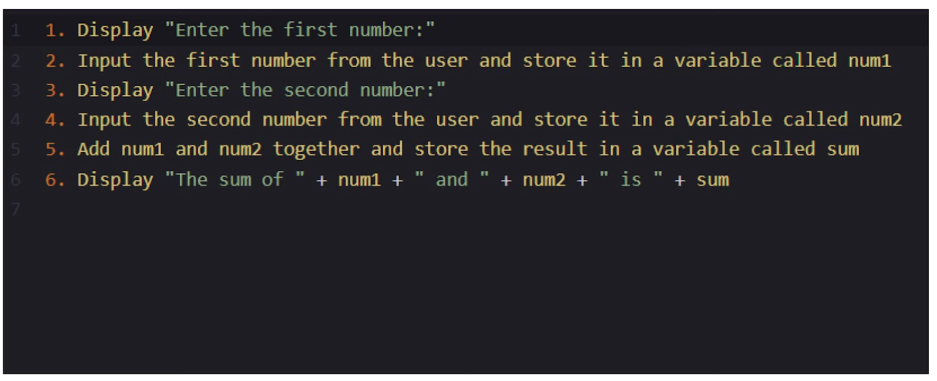
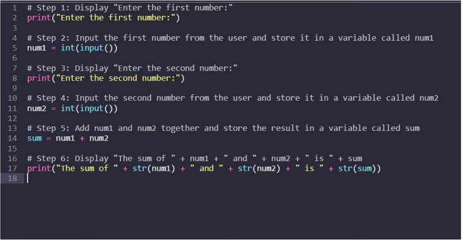

# What is Pseudocode Explained

### 1. Understand the problem
write a program that adds together two numbers.

### 2. Break down the problem into smaller steps
==2.1== Ask the user to input the first number ==2.2== Ask user to input the second number
==2.3== Add the two numbers together ==2.4== Display the sum to the user

### 3. Write out the pseudocode

### 4. Test the pseudocode

### 5. Translate the pseudocode into actual code

# Watch in Video:
[What is Pseudocode Explained | How to Write Pseudocode Algorithm | Examples, Benefits & Steps](https://youtu.be/qfckDdsEIq8?si=Ux33ZtvVfLAAKsbJ)
